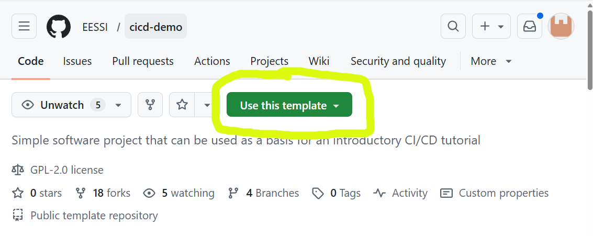
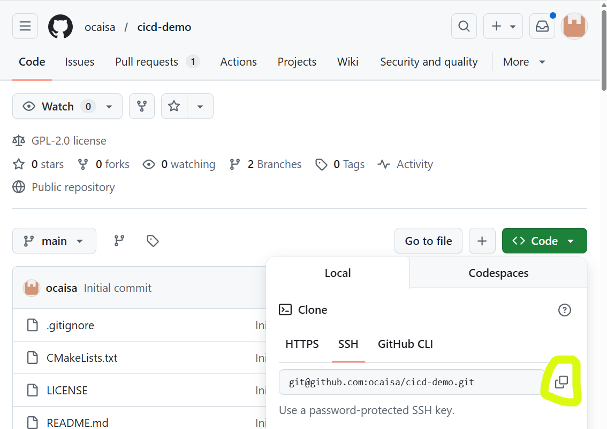

# Building on top of EESSI

!!! Note "Learning Objectives"

    * Explore a demonstrator project for the tutorial
    * Navigate EESSI to find consistent dependencies for our project
    * Understand how EESSI gives you independence from the host operating system
    * Build our project on top of EESSI and check that it works as intended

EESSI is sometimes described as "container without a container runtime". What that means is that it effectively
provides an alternative operating system to the native one without the need for something to negotiate between the two.
When we are _consuming_ software from EESSI, there is no real way to see this. It is only when we try to use EESSI as a
basis for building new sotware that we are exposed to the addional complexity that this can bring.

## Building a software project

Let us use a demonstrator software project to explore this topic. The purpose of the demonstrator is to allow us to
follow a reasonably common workflow when it comes to building software in a new resource/environment:

- Gather the dependencies we need for our project to build.
- Build the project.
- Ensure the final software works as intended.

### The demonstrator project

!!! Warning
   
    **The steps below assume that you have a GitHub account.**
    
    While an account is not strictly necessary for this episode,
    it will be necessary for the next episode so we introduce this requirement now. If you do not already have an
    account on GitHub, you can create one (at no cost) at <https://github.com/signup>.

    **We also assume in this tutorial that you have an ssh key registered with your GitHub account.**
    
    If this is not the case
    [GitHub has good documentation on how to do this](https://docs.github.com/en/authentication/connecting-to-github-with-ssh/adding-a-new-ssh-key-to-your-github-account).
    
    If you are using a cluster for this tutorial, you can create a new ssh key on the cluster and
    register the public part of the new key on GitHub.
    
    **Always remember, an SSH key is like a digital passport,
    make sure to protect it by a passphrase as the location where it is stored may not be secure**.

We have prepared a template for a demonstrator project that can be used throughout this tutorial. The first step is to
make your instance of the project from the template, for this you need to click on the link
<https://github.com/new?template_name=cicd-demo&template_owner=EESSI>
which will open a new
webpage from GitHub from which you can select where you would like to create the project. You can also get to this
page through the GitHub interface:

<p align="center"></p>

Once GitHub has created a project for you from the template, you can _clone_ the project to the local resource that
you wish to use (your laptop, a cluster,...) by copying the relevant command from the GitHub interface:

<p align="center"></p>

For example, for the repository shown in the image, the full command is 
``` { .bash .no-copy}
git clone git@github.com:ocaisa/cicd-demo.git
```
however, your exact repository will be different.
    

### Characteristics of our project

You can now explore the project, in particular taking a look at `README.md`.

``` { .bash .no-copy }
$ cd cicd-demo # (1)!

$ ls
CMakeLists.txt  LICENSE  README.md  main.cpp  verify.cpp

$ cat README.md
# MPI + HDF5 Parallel Hello World

This project demonstrates parallel writing to an HDF5 file using **MPI** and the **HDF5 C++ API**, and includes a verification step to validate the written data.

## Overview

- `main.cpp`: Uses MPI to run multiple processes, each writing its rank to a shared HDF5 dataset (`rank_data`) in parallel using **collective I/O**.
- `verify.cpp`: Reads the resulting HDF5 file and verifies that each rank wrote the correct value.
- `CMakeLists.txt`: CMake configuration to build both programs and run tests.

## Requirements

- CMake ≥ 3.20
- MPI (e.g., OpenMPI or MPICH)
- HDF5 with C++ support
...
```

1.  We assume here that you have already cloned your GitHub repository locally (and that you have named it `cicd-demo`)

Some characteristics of the project are

- Dependencies
    - The project can work in parallel across a large system, it uses MPI for communication, and HDF5 to write and read
      files  in parallel. Since we need both of these when we run our software, these are often called
      _runtime dependencies_.
- Building
    - The project uses a build tool called [`CMake`](https://cmake.org/) for building. Many software projects use this tool to help with
      the logistical challenge of building complex software.
    - This introduces another dependency on `CMake` itself which we only require during the building of the project.
      Such dependencies are often called _buildtime dependencies_.
- Testing
   - `CMake` has some features that allow for the running of tests that are included in our software project. This
     gives us an easy way to check both that our software runs, and that it gives correct results, without us needing
     to run and verify each check manually. 

### Loading our dependencies

We first need to provide our dependencies before we can build our project. We first need to ensure that EESSI is
initialised:
``` { .bash .copy}
source /cvmfs/software.eessi.io/versions/2025.06/init/lmod/bash
```

Now let's start with `HDF5`, and see if it is already available. We use `module spider hdf5` to search for any
available versions:
``` {.output .no-copy}
$ module spider hdf5

-------------------------------------------------------------------------------------------
  HDF5:
-------------------------------------------------------------------------------------------
    Description:
      HDF5 is a data model, library, and file format for storing and managing data. It
      supports an unlimited variety of datatypes, and is designed for flexible and
      efficient I/O and for high volume and complex data.

     Versions:
        HDF5/1.14.5-gompi-2024a
        HDF5/1.14.6-gompi-2025a
        HDF5/1.14.6-gompi-2025b

-------------------------------------------------------------------------------------------
  For detailed information about a specific "HDF5" package (including how to load the modules) use the module's full name.
  Note that names that have a trailing (E) are extensions provided by other modules.
  For example:

     $ module spider HDF5/1.14.6-gompi-2025b
-------------------------------------------------------------------------------------------

...
```
We can see there are multiple versions available, but which one do we choose? Our application doesn't specify a specific
version so we just choose the latest, `HDF5/1.14.6-gompi-2025b`, for now.The actual version of HDF5 is given by the
first part of `1.14.6-gompi-2025b`, in this case `1.14.6`; the final part `gompi-2025b` is related to the
[toolchain concept inside EasyBuild](https://docs.easybuild.io/common-toolchains/) and we won't get into that here
since it is not the purpose of the tutorial.

Having chose to try out `HDF5/1.14.6-gompi-2025b`, we can now load the module to make HDF5 available:
``` { .bash .copy}
module load HDF5/1.14.6-gompi-2025b
```

After wards we can check what our environment currently looks like with
``` { .bash .no-copy}
$ module list

Currently Loaded Modules:
  1) EESSI/2025.06                       11) libfabric/2.1.0-GCCcore-14.3.0
  2) GCCcore/14.3.0                      12) PMIx/5.0.8-GCCcore-14.3.0
  3) GCC/14.3.0                          13) PRRTE/3.0.11-GCCcore-14.3.0
  4) numactl/2.0.19-GCCcore-14.3.0       14) UCC/1.4.4-GCCcore-14.3.0
  5) libxml2/2.14.3-GCCcore-14.3.0       15) OpenMPI/5.0.8-GCC-14.3.0
  6) libpciaccess/0.18.1-GCCcore-14.3.0  16) gompi/2025b
  7) hwloc/2.12.1-GCCcore-14.3.0         17) libaec/1.1.4-GCCcore-14.3.0
  8) OpenSSL/3                           18) Perl/5.40.2-GCCcore-14.3.0
  9) libevent/2.1.12-GCCcore-14.3.0      19) HDF5/1.14.6-gompi-2025b
```
That's now a long of packages which make up the _runtime dependency tree_ of `HDF5`. That dependency tree includes
`OpenMPI/5.0.8-GCC-14.3.0` which means the list already satisfies the runtime requirements for our software package.

However, we are still missing our _build time dependency_ `CMake`. Can EESSI also provide that? Let's check with
``` { .bash .copy}
module spider cmake
```
Again, we see multiple possibilities
``` { .output }
$ module spider Cmake

-------------------------------------------------------------------------------------------
  CMake:
-------------------------------------------------------------------------------------------
    Description:
      CMake, the cross-platform, open-source build system. CMake is a family of tools
      designed to build, test and package software.

     Versions:
        CMake/3.29.3-GCCcore-13.3.0
        CMake/3.31.3-GCCcore-14.2.0
        CMake/3.31.8-GCCcore-14.3.0
        CMake/4.0.3-GCCcore-14.3.0

-------------------------------------------------------------------------------------------
  For detailed information about a specific "CMake" package (including how to load the modules) use the module's full name.
  Note that names that have a trailing (E) are extensions provided by other modules.
  For example:

     $ module spider CMake/4.0.3-GCCcore-14.3.0
-------------------------------------------------------------------------------------------
```
...so what do we choose? Our selection now has some constraints as we want to make a choice this is *consistent* with
our selected `HDF5` version. If we look at the list of packages loaded once we loaded `HDF5`, we can see that the
toolchain `GCCcore-14.3.0` popped up multiple times. If we want to keep a consistent environment then it looks lilke
there are two options
``` {.output .no-copy}
        CMake/3.31.8-GCCcore-14.3.0
        CMake/4.0.3-GCCcore-14.3.0
```
We don't have any reason to choose one over the other, so let's go with the most recent `CMake/4.0.3-GCCcore-14.3.0`
``` { .bash .copy }
module load CMake/4.0.3-GCCcore-14.3.0
```

With this module loaded, we now have all both our buildtime and runtime dependencies satisfied, and can proceed to
build our project.

### First attempt at building and testing our project

If we take a look at the build instructions inside our `README.md`, the build instructions are not too lengthy, and
follow a very common `CMake` pattern:
``` { .bash .copy }
mkdir build # (1)!
cd build
cmake ..  # (2)!
make  # (3)!
```

1. Make a directory to contain our build
2. Configure our build using the `CMake` files shipped in the project
3. Build the project with `make`

If we try this, we get output similar to
``` { .output .no-copy}
{EESSI/2025.06} $ module load CMake

{EESSI/2025.06} $ mkdir build

{EESSI/2025.06} $ cd build

{EESSI/2025.06} $ cmake ..
-- The CXX compiler identification is GNU 14.3.0
-- Detecting CXX compiler ABI info
-- Detecting CXX compiler ABI info - done
-- Check for working CXX compiler: /cvmfs/software.eessi.io/versions/2025.06/software/linux/aarch64/neoverse_n1/software/GCCcore/14.3.0/bin/c++ - skipped
-- Detecting CXX compile features
-- Detecting CXX compile features - done
-- Found MPI_CXX: /cvmfs/software.eessi.io/versions/2025.06/software/linux/aarch64/neoverse_n1/software/OpenMPI/5.0.8-GCC-14.3.0/lib/libmpi.so (found version "3.1")
-- Found MPI: TRUE (found version "3.1")
-- The C compiler identification is GNU 14.3.0
-- Detecting C compiler ABI info
-- Detecting C compiler ABI info - done
-- Check for working C compiler: /cvmfs/software.eessi.io/versions/2025.06/software/linux/aarch64/neoverse_n1/software/GCCcore/14.3.0/bin/cc - skipped
-- Detecting C compile features
-- Detecting C compile features - done
-- Found HDF5: hdf5_cpp-shared (found version "1.14.6") found components: CXX
-- Configuring done (4.5s)
-- Generating done (0.0s)
-- Build files have been written to: /home/ocaisa/EESSI/cicd-demo/build

{EESSI/2025.06} $ make
[ 25%] Building CXX object CMakeFiles/hello_mpi_hdf5.dir/main.cpp.o
[ 50%] Linking CXX executable hello_mpi_hdf5
[ 50%] Built target hello_mpi_hdf5
[ 75%] Building CXX object CMakeFiles/verify_hdf5.dir/verify.cpp.o
[100%] Linking CXX executable verify_hdf5
[100%] Built target verify_hdf5
```
This tells us that `CMake` found our GCC compiler, found our OpenMPI installation, found `HDF5` and was able to build
our project. :rocket:

:warning: **We're not done yet though!** :warning:

It's great that the project built, but we haven't tested it yet. Going back to our `README.md`, we find the command we
need to run the tests:
``` { .bash .copy }
ctest --output-on-failure --verbose
```

Our final step is to run that command and ensure it succeeds. If you do that you should see output similar to
``` { .output .no-copy }
{EESSI/2025.06} $ ctest --output-on-failure --verbose
UpdateCTestConfiguration  from :/home/ocaisa/EESSI/cicd-demo/build/DartConfiguration.tcl
Test project /home/ocaisa/EESSI/cicd-demo/build
Constructing a list of tests
Done constructing a list of tests
Updating test list for fixtures
Added 0 tests to meet fixture requirements
Checking test dependency graph...
Checking test dependency graph end
test 1
    Start 1: RunMPIProgram

1: Test command: /cvmfs/software.eessi.io/versions/2025.06/software/linux/aarch64/neoverse_n1/software/OpenMPI/5.0.8-GCC-14.3.0/bin/mpiexec "-n" "4" "/home/ocaisa/EESSI/cicd-demo/build/hello_mpi_hdf5"
1: Working Directory: /home/ocaisa/EESSI/cicd-demo/build
1: Test timeout computed to be: 9999879
1: /home/ocaisa/EESSI/cicd-demo/build/hello_mpi_hdf5: error while loading shared libraries: libhdf5_cpp.so.310: cannot open shared object file: No such file or directory
1: /home/ocaisa/EESSI/cicd-demo/build/hello_mpi_hdf5: error while loading shared libraries: libhdf5_cpp.so.310: cannot open shared object file: No such file or directory
1: /home/ocaisa/EESSI/cicd-demo/build/hello_mpi_hdf5: error while loading shared libraries: libhdf5_cpp.so.310: cannot open shared object file: No such file or directory
1: /home/ocaisa/EESSI/cicd-demo/build/hello_mpi_hdf5: error while loading shared libraries: libhdf5_cpp.so.310: cannot open shared object file: No such file or directory
1: --------------------------------------------------------------------------
1: prterun detected that one or more processes exited with non-zero status,
1: thus causing the job to be terminated. The first process to do so was:
1:
1:    Process name: [prterun-aoc-laptop-257891@1,3]
1:    Exit code:    127
1: --------------------------------------------------------------------------
1/2 Test #1: RunMPIProgram ....................***Failed    0.53 sec
/home/ocaisa/EESSI/cicd-demo/build/hello_mpi_hdf5: error while loading shared libraries: libhdf5_cpp.so.310: cannot open shared object file: No such file or directory
/home/ocaisa/EESSI/cicd-demo/build/hello_mpi_hdf5: error while loading shared libraries: libhdf5_cpp.so.310: cannot open shared object file: No such file or directory
/home/ocaisa/EESSI/cicd-demo/build/hello_mpi_hdf5: error while loading shared libraries: libhdf5_cpp.so.310: cannot open shared object file: No such file or directory
/home/ocaisa/EESSI/cicd-demo/build/hello_mpi_hdf5: error while loading shared libraries: libhdf5_cpp.so.310: cannot open shared object file: No such file or directory
--------------------------------------------------------------------------
prterun detected that one or more processes exited with non-zero status,
thus causing the job to be terminated. The first process to do so was:

   Process name: [prterun-aoc-laptop-257891@1,3]
   Exit code:    127
--------------------------------------------------------------------------

test 2
    Start 2: VerifyHDF5Output

2: Test command: /home/ocaisa/EESSI/cicd-demo/build/verify_hdf5
2: Working Directory: /home/ocaisa/EESSI/cicd-demo/build
2: Test timeout computed to be: 9999879
2: /home/ocaisa/EESSI/cicd-demo/build/verify_hdf5: error while loading shared libraries: libhdf5_cpp.so.310: cannot open shared object file: No such file or directory
2/2 Test #2: VerifyHDF5Output .................***Failed    0.00 sec
/home/ocaisa/EESSI/cicd-demo/build/verify_hdf5: error while loading shared libraries: libhdf5_cpp.so.310: cannot open shared object file: No such file or directory


0% tests passed, 2 tests failed out of 2

Total Test time (real) =   0.54 sec

The following tests FAILED:
          1 - RunMPIProgram (Failed)
          2 - VerifyHDF5Output (Failed)
Errors while running CTest
```

:anguished: All our tests failed!

Our output is full of errors like
``` { .output .no-copy }
/home/ocaisa/EESSI/cicd-demo/build/hello_mpi_hdf5: error while loading shared libraries: libhdf5_cpp.so.310: cannot open shared object file: No such file or directory
```
What went wrong?

### Why did our build fail the tests?

To understand where the failure is coming from, we first need to understand what actually happens when we try to run a
program on a computer.

### Using the `buildenv` module

### Building our project
 
