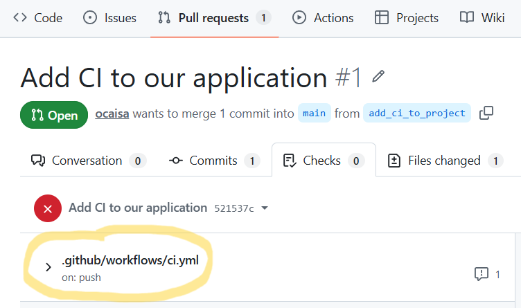
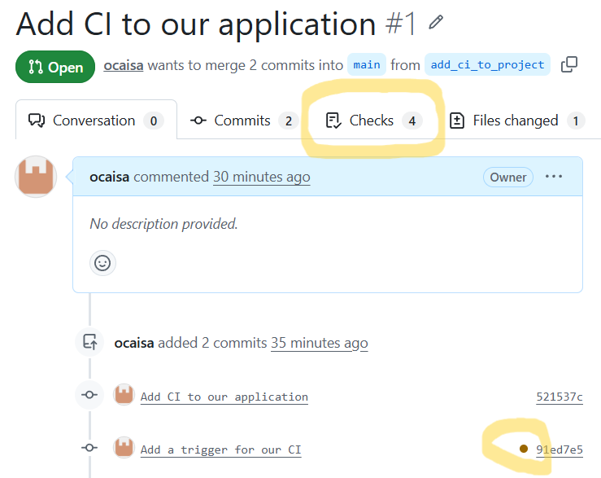
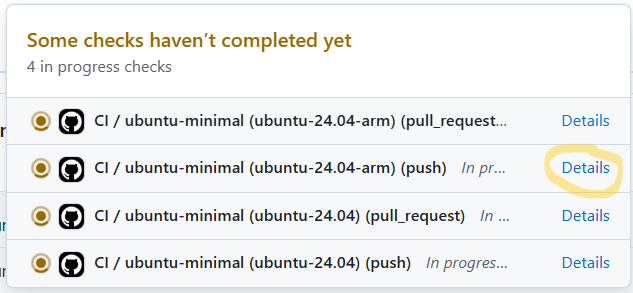

# EESSI for Continuous Integration (CI)

!!! Note "Learning Objectives"

    * Integrate CI based on EESSI into our software project
    * Navigate the CI interface of GitHub
    * Consider the benefits of CI integration

## What is Continuous Integration (CI)?

**Continuous Integration (CI)** is a software development practice where developers frequently merge their code changes
into a shared repository. Each time code is added or updated, automated processes build the application and run tests
to verify that everything still works correctly. This verification workflow is exactly the process we went through in
the last episode:

* Prepare the environment
* Build the application
* Make sure it works

CI is about automating that workflow to ensure it is carried out whenever we make changes to our
application...and letting us know when things go wrong!

CI is useful because it helps teams detect problems early. Instead of discovering bugs or integration issues weeks
later, developers receive immediate feedback when a change breaks the build or causes tests to fail. This makes issues
easier and less expensive to fix.

Another benefit of CI is improved collaboration. Since code is integrated regularly, team members are less likely to
encounter large merge conflicts. Automated testing also increases confidence that new features do not unintentionally
break existing functionality.

We will cover the popular CI tool [GitHub Actions](https://github.com/features/actions), and also a little of 
[GitLab CI/CD](https://docs.gitlab.com/ci/), as EESSI has built support for these. These tools automate building,
testing, and validating code whenever changes are committed.

## How can EESSI help with CI?

EESSI gives you a portable environment, whatever we can do locally with EESSI we should be able to do in other
locations where EESSI is available. One way to think of this is that EESSI enables portable workflows, and CI is
not really anything more than a specific workflow.

However, workflows based on EESSI are only portable if EESSI is
available on the platform where the workflow is carried out. For this reason, EESSI has built some tooling for GitHub
and GitLab to make sure this is the case:

* The EESSI GitHub Action can be found on the [GitHub Marketplace](https://github.com/marketplace),
  at [https://github.com/marketplace/actions/eessi](https://github.com/marketplace/actions/eessi).

* The EESSI GitLab CI/CD component can be found in the [GitLab CI/CD Catalog](https://gitlab.com/explore/catalog), at
  [https://gitlab.com/explore/catalog/eessi/gitlab-eessi](https://gitlab.com/explore/catalog/eessi/gitlab-eessi). It
  is possible to use the [EESSI GitLab Component](https://gitlab.com/explore/catalog/eessi/gitlab-eessi) in a
  self-hosted GitLab instance, documentation on how to do this is available at
  <https://docs.gitlab.com/ci/components/#use-a-gitlabcom-component-on-gitlab-self-managed>.


## Adding CI based on EESSI to our software project

??? question "But I use GitLab not GitHub :disappointed:"

    The [EESSI GitLab Component](https://gitlab.com/explore/catalog/eessi/gitlab-eessi) also exists, and this allows
    you to follow a very similar approach to that described
    here for GitHub. At the end of the episode we will provide the equivalent file needed to enable GitLab CI.

The first thing we need to do is to translate our workflow into something that the workflow tool, GitHub Actions in
this case, can understand. GitHub itself has
[extensive documentation on using GitHub Actions](https://docs.github.com/en/actions) which we are not going to
reproduce, instead we will jump straight to the documentation for the
[EESSI GitHub Action](https://github.com/marketplace/actions/eessi#instructions) and try to adapt it for our use case.
An interesting example jumps out, which the documentation says
> will run on both `x86_64` and `Arm` architectures

``` { .yaml .copy }
jobs:
  ubuntu-minimal:
    runs-on: ${{ matrix.os }}
    strategy:
      matrix:
        os:
          - ubuntu-24.04-arm
          - ubuntu-24.04
    steps:
    - uses: actions/checkout@v6
    - uses: eessi/github-action-eessi@v3
      with:
        eessi_stack_version: '2025.06'
    - name: Test EESSI
      run: |
        module avail
      shell: bash
```
If you've never seen a GitHub Action file before, there is lot to pick apart here. Some key parts are

* It runs the CI on both `ubuntu-24.04-arm` and `ubuntu-24.04`
* It "checks out" the code repository where the file is stored
* It uses `eessi/github-action-eessi` to configure the environment for `EESSI/2025.06`
* The test it runs is a basic `module avail`

!!! warning "I need more information than that!"
    Unfortunately, we won't get into the details here of the syntax being used other than to say it is
    [YAML](https://yaml.org/). If you would like a detailed explanation, we recommend that you talk to an LLM to have
    it explain it to you. They are very powerful when it comes to helping with CI, and we will use this later to help
    us solve problems.

What does our workflow look like? Well, we can summarise it in a few commands once `EESSI/2025.06` is loaded and
available and we are in the base directory of our repository:
``` { .bash .copy}
module load CMake/4.0.3-GCCcore-14.3.0  # (1)!
module load HDF5/1.14.6-gompi-2025b  # (2)!
module load buildenv/default-foss-2025b  # (3)!
mkdir build
cd build
cmake ..  # (4)!
make -j  # (5)!
ctest --output-on-failure --verbose  # (6)!
```

1. Load our build dependency on `CMake`
2. Load our runtime dependency on `HDF5` (and, implicitly, `MPI`)
3. Load the `buildenv` module so we use the `RPATH` wrappers
4. Run `cmake` for our project
5. Build the project
6. Run our tests

One thing we can do then is to just add our workflow to the example from the documentation. We need to be a little
careful to respect the YAML syntax, but in the end we would have something like
``` { .yaml .copy }
jobs:
  ubuntu-minimal:
    runs-on: ${{ matrix.os }}
    strategy:
      matrix:
        os:
          - ubuntu-24.04-arm
          - ubuntu-24.04
    steps:
    - uses: actions/checkout@v6
    - uses: eessi/github-action-eessi@v3
      with:
        eessi_stack_version: '2025.06'
    - name: Build and test our package
      run: |
        module load CMake/4.0.3-GCCcore-14.3.0  
        module load HDF5/1.14.6-gompi-2025b  
        module load buildenv/default-foss-2025b  
        mkdir build
        cd build
        cmake ..  
        make -j  
        ctest --output-on-failure --verbose
      shell: bash
```

### How do we actually enable our CI?

In GitHub Actions, workflow files are stored in the `.github/workflows/` directory of your repository. You can either
use `.yml` or `.yaml` as the file extension for your workflow file, and GitHub will recognize them as an intended
workflow.

Let's give it a try. First, we need to enter the directory of **our** repository (which we created and cloned in the
last episode). Then let's make a
[feature branch](https://www.atlassian.com/git/tutorials/comparing-workflows/feature-branch-workflow) and create the
folder structure for our CI

``` { .bash .copy }
cd cicd-demo  # (1)!
git checkout -b add_ci_to_project  # (2)!
mkdir --parents .github/workflows/  # (3)!
```

1. Enter our repository
2. Checkout a branch (copy) of our repository with a specific name
3. Make the directory structure to store our CI

Now, let's add the CI file (that we are hoping will work) to that directory
```yaml title="ci.yml"
--8<-- "scripts/ci-incomplete.yml"
```

We now add that to git and push the branch to GitHub to try to trigger GitHub Actions.

``` { .bash .copy }
git add .github/workflows/ci.yml  # (1)!
git commit -m "Add CI to our application"  # (2)!
git push origin add_ci_to_project  # (3)!
```

1. Add the new file to our git repository.
2. Commit the file with a helpful comment.
3. Push the new branch to our repository on GitHub.

After completing the final command we see something like
``` { .output .no-copy}
...
remote: Resolving deltas: 100% (1/1), completed with 1 local object.
remote:
remote: Create a pull request for 'add_ci_to_project' on GitHub by visiting:
remote:      https://github.com/vlad/cicd-demo/pull/new/add_ci_to_project
remote:
To github.com:vlad/cicd-demo.git
 * [new branch]      add_ci_to_project -> add_ci_to_project
...
```
(where `vlad` is replaced by your own GitHub user handle). Let's go ahead and create the pull request lile the text
suggested by visiting the URL. Once we open the link, we can modify the title/description if we wish, but otherwise
we can just go ahead and click "Create pull request".

We see a new Pull Request opened, but there doesn't seem to be anything else obvious going on. The PR has a few tabs
though, one of which is "Checks" which sounds a little interesting. Let's click on that and see what happens.

<p align="center"></p>

Hmm, there is a big red X there for some reason, and our workflow file does appear there. Let's explore why by clicking
on our file name. That brings us to another page where the URL looks like
`https://github.com/vlad/cicd-demo/actions/runs/27020476886`, so it definitely has something to do with Actions. Under
"Annotations" we see another big X and an error
``` { .output .no-copy }
Error
No event triggers defined in `on`
```
but what does that mean?

To figure that out, let's use an LLM. We can say that we have this error in GitHub Actions and paste the error and the
current contents of our YAML file in for context. For ChatGPT, this returns some very useful information

> The error:
> > Error: No event triggers defined in on
>
> means your GitHub Actions workflow file is missing the required top-level `on:` section. Every workflow must specify
> what events trigger it.

and goes to explain that we need to add additional lines to the top of the file to indicate our triggers:

``` { .yaml .copy}
name: CI

on:
  push:
  pull_request:
```
which tells GitHub Actions that it should be triggered for every `push` and every Pull Request.

Let's add that content to our `ci.yml` file
```yaml title="ci.yml"
--8<-- "scripts/ci.yml"
```
and push the updated file back to GitHub
``` { .bash .copy }
git add .github/workflows/ci.yml
git commit -m "Add a trigger for our CI"
git push origin add_ci_to_project
```

Now, if we browse to the Pull Requests of our repository, we can see that something is happening.

<p align="center"></p>

A new little brown button has appeared beside our commit, and "Checks" now has 4 items. If we click on the brown
button a new box pops up that indicates that 4 different CI runs are executing.

<p align="center"></p>

2 of these are for the push, one for each architecture, and two more for the Pull Request, again one for each
architecture. If we click on `Details` for one of the runs, we get taken to where the workflow is actually running,
and the output it is generating.

The run is broken down into `steps`, each of which has a name. The one we are interested in is
`Build and test our package`, which is where we defined our build processs. While the build is running we can read the
output, or we can view it after the run completes. Regardless, we note that the output is almost identical to that
which we had when we ran the workflow ourselves. This is no more than we expect in reality, since this is what EESSI
is supposed to deliver for us.

If we wait a little we should see that our CI will succeed! :rocket: When it does the brown button in our Pull Request
will become a green tick which indicates that our CI for the commit has passed.

??? note "What would have our CI looked like in GitLab?"

    There are not so many real differences with how our specific CI would have looked like in GitLab CI/CD. The core
    steps that we need to run are the same, but the structure to get to them is different. Again an LLM is of major
    assistance when creating our CI file for GitLab.

    One major practical difference is where the CI file is stored and what it is called. In the case of GitLab CI/CD,
    the workflow must be stored in a file called
    `.gitlab-ci.yml` in the base directory of the repository. The documentation of EESSI GitLab component
    again provides a starting point from which we can construct a final CI file:
    ```yaml title=".gitlab-ci.yml"
    --8<-- "scripts/.gitlab-ci.yml"
    ```

### What happens when CI fails?

What does a failure look like in CI? From the previous episode, we know that if we do not load the `buildenv` module
our tests should fail. Let's
construct that scenario, by commenting out the line that loads that module:
```yaml title="ci.yml"
--8<-- "scripts/ci-broken.yml"
```

We can now push the change to our Pull Request to rerun the CI.
``` { .bash .copy }
git add .github/workflows/ci.yml
git commit -m "Don't load buildenv, which should break our CI"
git push origin add_ci_to_project
```

Eventually, as expected, our CI will fail and we will get a red X beside our commit. We should also receive an email
notification that our CI has failed. Such notifications are a critical part of CI, the value of CI is not just that
the tests run silently, but that we are made aware immediately when things go wrong.

## Benefits of CI

By automatically building and validating software whenever changes are made,
CI helps developers identify issues early, reduce integration problems, and maintain confidence in the stability of
their code.

Combined with EESSI’s reproducible software environment, CI ensures that applications are tested under the
same conditions regardless of where they are executed, improving reliability, collaboration, and overall software
quality throughout the development process.

It also means that when things go wrong, it is straightforward for us to drop into the environment where the tests
fail, and interactively explore the problem. 
