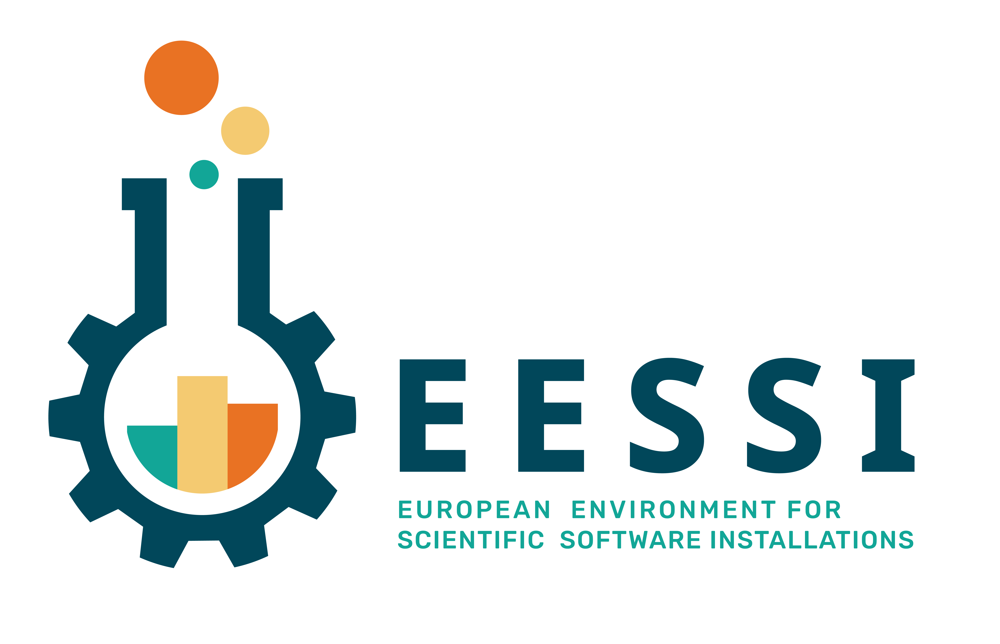

# EESSI Tutorial

Welcome to this tutorial on the [**European Environment for Scientific Software Installations (EESSI)**](https://www.eessi.io/docs/).

EESSI provides a shared, portable, and optimized software stack for scientific computing across a wide range of HPC systems and Linux environments.

## Tutorial Contents

1. [Getting Access to EESSI](eessi-getting-access.md)
2. [Introduction to EESSI](eessi-introduction.md)
3. [Using EESSI](eessi-usage.md)
4. [EESSI Use Cases](eessi-use-cases.md)
5. [Building on top of EESSI](building-on-top.md)
6. [Using EESSI in CI](eessi-in-ci.md)
7. [Advanced topics](advanced-topics.md)

## Learning Objectives

After completing this tutorial, you will be able to:

- Explain the purpose and benefits of EESSI.
- Access EESSI on supported systems.
- Run software provided through EESSI.
- Identify scenarios where EESSI can simplify scientific software deployment and usage.

## Audience

This tutorial is intended for researchers, students, HPC users, and system administrators who want to use scientific software through EESSI.
