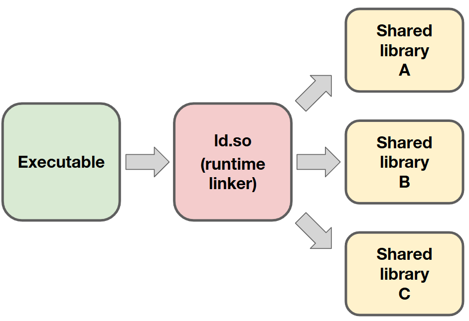

# Installing software on top of EESSI

!!! Note "Learning Objectives"

    * Explore a demonstrator project for the tutorial
    * Navigate EESSI to find consistent dependencies for our project
    * Understand how EESSI gives you independence from the host operating system
    * Build our project on top of EESSI and check that it works as intended

EESSI is sometimes described as "container without a container runtime". What that means is that it effectively
provides an alternative operating system to the native one without the need for something to negotiate between the two.
When we are _consuming_ software from EESSI, there is no real way to see this. It is only when we try to use EESSI as a
basis for building new software that we are exposed to the additional complexity that this can bring.

## Building a software project

Let us use a demonstrator software project to explore this topic. The purpose of the demonstrator is to allow us to
follow a reasonably common workflow when it comes to building software in a new resource/environment:

- Gather the dependencies we need for our project to build.
- Build the project.
- Ensure the final software works as intended.

### The demonstrator project

!!! Warning
   
    **The steps below assume that you have a GitHub account.**
    
    While an account is not strictly necessary for this episode,
    it will be necessary for the next episode so we introduce this requirement now. If you do not already have an
    account on GitHub, you can create one (at no cost) at <https://github.com/signup>.

    **We also assume in this tutorial that you have an ssh key registered with your GitHub account.**
    
    If this is not the case
    [GitHub has good documentation on how to do this](https://docs.github.com/en/authentication/connecting-to-github-with-ssh/adding-a-new-ssh-key-to-your-github-account).
    
    If you are using a cluster for this tutorial, you can create a new ssh key on the cluster and
    register the public part of the new key on GitHub.
    
    **Always remember, an SSH key is like a digital passport,
    make sure to protect it by a passphrase as the location where it is stored may not be secure**.

We have prepared a template for a demonstrator project that can be used throughout this tutorial. The first step is to
make your instance of the project from the template, for this you need to click on the link
<https://github.com/new?template_name=cicd-demo&template_owner=EESSI>
which will open a new
webpage from GitHub from which you can select where you would like to create the project. You can also get to this
page through the GitHub interface:

<p align="center"></p>

!!! warning "Naming your project"

    We suggest you name your project `cicd-demo` so that the name remains
    consistent with the commands given in the rest of the tutorial.

Once GitHub has created a project for you from the template, you can _clone_ the project to the local resource that
you wish to use (your laptop, a cluster,...) by copying the relevant command from the GitHub interface:

<p align="center"></p>

For example, for the repository shown in the image, the full command is 
``` { .bash .no-copy}
git clone git@github.com:ocaisa/cicd-demo.git
```
however, your exact repository will be different.
    

### Characteristics of our project

You can now explore the project, in particular taking a look at `README.md`.

``` { .bash .no-copy }
$ cd cicd-demo # (1)!

$ ls
CMakeLists.txt  LICENSE  README.md  main.cpp  verify.cpp

$ cat README.md
# MPI + HDF5 Parallel Hello World

This project demonstrates parallel writing to an HDF5 file using **MPI** and the **HDF5 C++ API**, and includes a verification step to validate the written data.

## Overview

- `main.cpp`: Uses MPI to run multiple processes, each writing its rank to a shared HDF5 dataset (`rank_data`) in parallel using **collective I/O**.
- `verify.cpp`: Reads the resulting HDF5 file and verifies that each rank wrote the correct value.
- `CMakeLists.txt`: CMake configuration to build both programs and run tests.

## Requirements

- CMake ≥ 3.20
- MPI (e.g., OpenMPI or MPICH)
- HDF5 with C++ support
...
```

1.  We assume here that you have already cloned your GitHub repository locally (and that you have named it `cicd-demo`)

Some characteristics of the project are

- Dependencies
    - The project can work in parallel across a large system, it uses MPI for communication, and HDF5 to write and read
      files  in parallel. Since we need both of these when we run our software, these are often called
      _runtime dependencies_.
- Building
    - The project uses a build tool called [`CMake`](https://cmake.org/) for building. Many software projects use this tool to help with
      the logistical challenge of building complex software.
    - This introduces another dependency on `CMake` itself which we only require during the building of the project.
      Such dependencies are often called _build-time dependencies_.
- Testing
    - `CMake` has some features that allow for the running of tests that are included in our software project. This
      gives us an easy way to check both that our software runs, and that it gives correct results, without us needing
      to run and verify each check manually. 

### Loading our dependencies

We first need to provide our dependencies before we can build our project. But before we can do that, we need to ensure that EESSI is
initialised:
``` { .bash .copy}
source /cvmfs/software.eessi.io/versions/2025.06/init/lmod/bash
```

Now let's start with `HDF5`, and see if it is already available. We use `module spider hdf5` to search for any
available versions:
``` {.output .no-copy}
$ module spider hdf5

-------------------------------------------------------------------------------------------
  HDF5:
-------------------------------------------------------------------------------------------
    Description:
      HDF5 is a data model, library, and file format for storing and managing data. It
      supports an unlimited variety of datatypes, and is designed for flexible and
      efficient I/O and for high volume and complex data.

     Versions:
        HDF5/1.14.5-gompi-2024a
        HDF5/1.14.6-gompi-2025a
        HDF5/1.14.6-gompi-2025b

-------------------------------------------------------------------------------------------
  For detailed information about a specific "HDF5" package (including how to load the modules) use the module's full name.
  Note that names that have a trailing (E) are extensions provided by other modules.
  For example:

     $ module spider HDF5/1.14.6-gompi-2025b
-------------------------------------------------------------------------------------------

...
```
We can see there are multiple versions available, but which one do we choose? Our application doesn't specify a specific
version so we just choose the latest, `HDF5/1.14.6-gompi-2025b`, for now.The actual version of HDF5 is given by the
first part of `1.14.6-gompi-2025b`, in this case `1.14.6`; the final part `gompi-2025b` is related to the
[toolchain concept used by EasyBuild](https://docs.easybuild.io/common-toolchains/). We won't dive into that toolchain
concept here since it is not the purpose of the tutorial.

Since we chose to try out `HDF5/1.14.6-gompi-2025b`, we can now load the module to make HDF5 available:
``` { .bash .copy}
module load HDF5/1.14.6-gompi-2025b
```

Once HDF5 is loaded, we can check what our environment currently looks like with:
``` { .bash .no-copy}
$ module list

Currently Loaded Modules:
  1) EESSI/2025.06                       11) libfabric/2.1.0-GCCcore-14.3.0
  2) GCCcore/14.3.0                      12) PMIx/5.0.8-GCCcore-14.3.0
  3) GCC/14.3.0                          13) PRRTE/3.0.11-GCCcore-14.3.0
  4) numactl/2.0.19-GCCcore-14.3.0       14) UCC/1.4.4-GCCcore-14.3.0
  5) libxml2/2.14.3-GCCcore-14.3.0       15) OpenMPI/5.0.8-GCC-14.3.0
  6) libpciaccess/0.18.1-GCCcore-14.3.0  16) gompi/2025b
  7) hwloc/2.12.1-GCCcore-14.3.0         17) libaec/1.1.4-GCCcore-14.3.0
  8) OpenSSL/3                           18) Perl/5.40.2-GCCcore-14.3.0
  9) libevent/2.1.12-GCCcore-14.3.0      19) HDF5/1.14.6-gompi-2025b
```
That will show a long list of packages which make up the _runtime dependency tree_ of `HDF5`. That dependency tree includes
`OpenMPI/5.0.8-GCC-14.3.0` which means the list already satisfies the runtime requirements for our software package.

However, we are still missing our _build-time dependency_ `CMake`. Can EESSI also provide that? Let's check with
``` { .bash .copy}
module spider cmake
```
Again, we see multiple possibilities
``` { .output }
$ module spider Cmake

-------------------------------------------------------------------------------------------
  CMake:
-------------------------------------------------------------------------------------------
    Description:
      CMake, the cross-platform, open-source build system. CMake is a family of tools
      designed to build, test and package software.

     Versions:
        CMake/3.29.3-GCCcore-13.3.0
        CMake/3.31.3-GCCcore-14.2.0
        CMake/3.31.8-GCCcore-14.3.0
        CMake/4.0.3-GCCcore-14.3.0

-------------------------------------------------------------------------------------------
  For detailed information about a specific "CMake" package (including how to load the modules) use the module's full name.
  Note that names that have a trailing (E) are extensions provided by other modules.
  For example:

     $ module spider CMake/4.0.3-GCCcore-14.3.0
-------------------------------------------------------------------------------------------
```
...so what do we choose? Our selection now has some constraints as we want to make a choice this is *consistent* with
our selected `HDF5` version. If we look at the list of packages loaded once we loaded `HDF5`, we can see that the
toolchain `GCCcore-14.3.0` popped up multiple times. If we want to keep a consistent environment then it looks lilke
there are two options
``` {.output .no-copy}
        CMake/3.31.8-GCCcore-14.3.0
        CMake/4.0.3-GCCcore-14.3.0
```
We don't have any reason to choose one over the other, so let's go with the most recent `CMake/4.0.3-GCCcore-14.3.0`
``` { .bash .copy }
module load CMake/4.0.3-GCCcore-14.3.0
```

With this module loaded, we now have both our build-time and runtime dependencies satisfied, and can proceed to
build our project.

### First attempt at building and testing our project

If we take a look at the build instructions inside our `README.md`, the build instructions are not too lengthy, and
follow a very common `CMake` pattern:
``` { .bash .copy }
mkdir build # (1)!
cd build
cmake ..  # (2)!
make  # (3)!
```

1. Make a directory to contain our build
2. Configure our build using the `CMake` files shipped in the project
3. Build the project with `make`

If we try this, we get output similar to
``` { .output .no-copy}
{EESSI/2025.06} $ mkdir build

{EESSI/2025.06} $ cd build

{EESSI/2025.06} $ cmake ..
-- The CXX compiler identification is GNU 14.3.0
-- Detecting CXX compiler ABI info
-- Detecting CXX compiler ABI info - done
-- Check for working CXX compiler: /cvmfs/software.eessi.io/versions/2025.06/software/linux/aarch64/neoverse_n1/software/GCCcore/14.3.0/bin/c++ - skipped
-- Detecting CXX compile features
-- Detecting CXX compile features - done
-- Found MPI_CXX: /cvmfs/software.eessi.io/versions/2025.06/software/linux/aarch64/neoverse_n1/software/OpenMPI/5.0.8-GCC-14.3.0/lib/libmpi.so (found version "3.1")
-- Found MPI: TRUE (found version "3.1")
-- The C compiler identification is GNU 14.3.0
-- Detecting C compiler ABI info
-- Detecting C compiler ABI info - done
-- Check for working C compiler: /cvmfs/software.eessi.io/versions/2025.06/software/linux/aarch64/neoverse_n1/software/GCCcore/14.3.0/bin/cc - skipped
-- Detecting C compile features
-- Detecting C compile features - done
-- Found HDF5: hdf5_cpp-shared (found version "1.14.6") found components: CXX
-- Configuring done (4.5s)
-- Generating done (0.0s)
-- Build files have been written to: /home/ocaisa/EESSI/cicd-demo/build

{EESSI/2025.06} $ make
[ 25%] Building CXX object CMakeFiles/hello_mpi_hdf5.dir/main.cpp.o
[ 50%] Linking CXX executable hello_mpi_hdf5
[ 50%] Built target hello_mpi_hdf5
[ 75%] Building CXX object CMakeFiles/verify_hdf5.dir/verify.cpp.o
[100%] Linking CXX executable verify_hdf5
[100%] Built target verify_hdf5
```
This tells us that `CMake` found our GCC compiler, found our OpenMPI installation, found `HDF5` and was able to build
our project. :rocket:

:warning: **We're not done yet though!** :warning:

It's great that the project built, but we haven't tested it yet. Going back to our `README.md`, we find the command we
need to run the tests:
``` { .bash .copy }
ctest --output-on-failure --verbose
```

Our final step is to run that command and ensure it succeeds. If you do that you should see output similar to
``` { .output .no-copy }
{EESSI/2025.06} $ ctest --output-on-failure --verbose
UpdateCTestConfiguration  from :/home/ocaisa/EESSI/cicd-demo/build/DartConfiguration.tcl
Test project /home/ocaisa/EESSI/cicd-demo/build
Constructing a list of tests
Done constructing a list of tests
Updating test list for fixtures
Added 0 tests to meet fixture requirements
Checking test dependency graph...
Checking test dependency graph end
test 1
    Start 1: RunMPIProgram

1: Test command: /cvmfs/software.eessi.io/versions/2025.06/software/linux/aarch64/neoverse_n1/software/OpenMPI/5.0.8-GCC-14.3.0/bin/mpiexec "-n" "4" "/home/ocaisa/EESSI/cicd-demo/build/hello_mpi_hdf5"
1: Working Directory: /home/ocaisa/EESSI/cicd-demo/build
1: Test timeout computed to be: 9999879
1: /home/ocaisa/EESSI/cicd-demo/build/hello_mpi_hdf5: error while loading shared libraries: libhdf5_cpp.so.310: cannot open shared object file: No such file or directory
1: /home/ocaisa/EESSI/cicd-demo/build/hello_mpi_hdf5: error while loading shared libraries: libhdf5_cpp.so.310: cannot open shared object file: No such file or directory
1: /home/ocaisa/EESSI/cicd-demo/build/hello_mpi_hdf5: error while loading shared libraries: libhdf5_cpp.so.310: cannot open shared object file: No such file or directory
1: /home/ocaisa/EESSI/cicd-demo/build/hello_mpi_hdf5: error while loading shared libraries: libhdf5_cpp.so.310: cannot open shared object file: No such file or directory
1: --------------------------------------------------------------------------
1: prterun detected that one or more processes exited with non-zero status,
1: thus causing the job to be terminated. The first process to do so was:
1:
1:    Process name: [prterun-aoc-laptop-257891@1,3]
1:    Exit code:    127
1: --------------------------------------------------------------------------
1/2 Test #1: RunMPIProgram ....................***Failed    0.53 sec
/home/ocaisa/EESSI/cicd-demo/build/hello_mpi_hdf5: error while loading shared libraries: libhdf5_cpp.so.310: cannot open shared object file: No such file or directory
/home/ocaisa/EESSI/cicd-demo/build/hello_mpi_hdf5: error while loading shared libraries: libhdf5_cpp.so.310: cannot open shared object file: No such file or directory
/home/ocaisa/EESSI/cicd-demo/build/hello_mpi_hdf5: error while loading shared libraries: libhdf5_cpp.so.310: cannot open shared object file: No such file or directory
/home/ocaisa/EESSI/cicd-demo/build/hello_mpi_hdf5: error while loading shared libraries: libhdf5_cpp.so.310: cannot open shared object file: No such file or directory
--------------------------------------------------------------------------
prterun detected that one or more processes exited with non-zero status,
thus causing the job to be terminated. The first process to do so was:

   Process name: [prterun-aoc-laptop-257891@1,3]
   Exit code:    127
--------------------------------------------------------------------------

test 2
    Start 2: VerifyHDF5Output

2: Test command: /home/ocaisa/EESSI/cicd-demo/build/verify_hdf5
2: Working Directory: /home/ocaisa/EESSI/cicd-demo/build
2: Test timeout computed to be: 9999879
2: /home/ocaisa/EESSI/cicd-demo/build/verify_hdf5: error while loading shared libraries: libhdf5_cpp.so.310: cannot open shared object file: No such file or directory
2/2 Test #2: VerifyHDF5Output .................***Failed    0.00 sec
/home/ocaisa/EESSI/cicd-demo/build/verify_hdf5: error while loading shared libraries: libhdf5_cpp.so.310: cannot open shared object file: No such file or directory


0% tests passed, 2 tests failed out of 2

Total Test time (real) =   0.54 sec

The following tests FAILED:
          1 - RunMPIProgram (Failed)
          2 - VerifyHDF5Output (Failed)
Errors while running CTest
```

:anguished: All our tests failed!

Our output is full of errors like
``` { .output .no-copy }
/home/ocaisa/EESSI/cicd-demo/build/hello_mpi_hdf5: error while loading shared libraries: libhdf5_cpp.so.310: cannot open shared object file: No such file or directory
```
What went wrong?

??? warning "`There are not enough slots available in the system to satisfy...`"

    If you see a different error which starts with `There are not enough slots available in the system to satisfy...`
    this is because you are trying to run an MPI job while already in a Slurm job context (perhaps an interactive
    JupyterHub job). Our workload here is really small so we can safely tell OpenMPI that is ok to overload the CPUs:
    ``` { .bash .copy }
    export PRTE_MCA_rmaps_default_mapping_policy=:oversubscribe
    ```
    (this environment variable works with OpenMPI 5)

## Why did our build fail the tests when using EESSI?

To understand where the failure is coming from, we first need to understand what actually happens when we try to run a
program on a computer. Our applications that we want to run take up space in memory, but many of them share parts of
their dependency tree. For example, every application built with the `GCC` compiler, require the `GCC` compiler runtime
libraries. Having every executable we run include a copy of that library internally in is a waste of space in memory, since all
programs need exactly the same libraries.

To save space (and to allow us to upgrade the libraries), dynamically linked
programs use _shared libraries_. A runtime loader in Linux (often called the dynamic linker/loader) is
responsible for loading shared libraries required by a program when it starts.
It resolves symbols and links the program to the correct library functions and variables at runtime.
This allows multiple programs to share the same libraries in memory and enables libraries to be updated independently
of applications.

<p align="center"></p>

The runtime loader is perhaps the most critical part of any operating system, as it controls the behaviour of most
applications on any system.

### What affects the behaviour of the runtime loader?

There are a few things that can impact the behaviour of the runtime loader:

* Hints in the environment about where to look for our shared libraries. `LD_LIBRARY_PATH` in particular is typically
  used to influence the behaviour of the runtime loader.
* Information can be stored directly in the library/application that you are trying to load. At compile time, we can
  store information about the paths to search when looking for libraries. This can be done in such a way that it can
  be overridden by `LD_LIBRARY_PATH` (`RUNPATH` linking), or in a way where `LD_LIBRARY_PATH` has no influence
  (`RPATH` linking).
* The runtime loader also has default locations it searches for libraries. These are used as a last resort.

For a given application or library, we can inspect what the runtime loader will resolve the shared libraries to
using the command `ldd`. For our failed build, we can do this on the binary `hello_mpi_hdf5`, which was created by our
build (and mentioned in some of our errors):
``` { .bash .no-copy}
{EESSI/2025.06} $ ldd hello_mpi_hdf5
        linux-vdso.so.1 (0x0000f1bedad95000)
        libmpi.so.40 => /cvmfs/software.eessi.io/versions/2025.06/software/linux/aarch64/neoverse_n1/software/OpenMPI/5.0.8-GCC-14.3.0/lib/libmpi.so.40 (0x0000f1bedaa10000)
        libhdf5_cpp.so.310 => not found
        libhdf5.so.310 => not found
        ...
```
While a lot of libraries are listed, we note that only two of them are not found: the ones related to `HDF5`! Why not
though? Why couldn't the runtime loader find them? For that we need to think again about how EESSI works.

### EESSI ships its own runtime loader

The reason EESSI is like a container is because when it builds and ships applications and libraries, it tells them to
use the runtime loader from the EESSI compatibility layer, not from the local operating system. This is what gives us
independence from the underlying operating system.

However, because EESSI needs to live side-by-side with the underlying operating system,
we cannot use `LD_LIBRARY_PATH` to help the loader to find libraries (as setting this also affects the behaviour of the
host runtime loader, which may unintentionally break applications coming from the host). EESSI therefore must use
`RPATH`-linking for all of the programs it ships in the software layer.

We can inspect the RPATH information encoded in a library using a tool called `patchelf` (which is
shipped in EESSI):
``` { .bash .no-copy }
{EESSI/2025.06} $ patchelf --print-rpath hello_mpi_hdf5
/cvmfs/software.eessi.io/versions/2025.06/software/linux/aarch64/neoverse_n1/software/OpenMPI/5.0.8-GCC-14.3.0/lib
```
So there is some information in the RPATH header of our executable that tells it where to find the MPI libraries
(and it _does_ find them as we saw in our `ldd` output), but there is nothing there to tell it where to find the
`HDF5` libraries.

To inject this information  _inside the binary_ we need to instruct the compiler that this information is
required when we build our application. This is very tedious though as it requires lot of compiler flags when there are
lots of dependencies, and
when we are building lots of applications with lots of different dependencies it gets very complex quickly. Instead, we
use _compiler wrappers_ to automatically inject the required flags into the compiler command based on the modules we
have loaded at the time we do the compilation.

This is done by default for everything that EESSI itself ships, but when building software manually with EESSI we
need to somehow activate these wrappers. That is where the EESSI `buildenv` module comes in.

## Using the `buildenv` module

EESSI provides the compiler wrappers needed to inject the `RPATH` information automatically into the things that are
compiled. It does this via module file created for this purpose: `buildenv`. The `buildenv` module also sets
environment variables that are used by build tools such as `CMake` and `Autotools`, which should help applications
respect that they should prioritise the dependencies that come from EESSI.

We can search for the available versions of `buildenv` using `module spider`:

``` { .bash .no-copy}
{EESSI/2025.06} $ module spider buildenv

------------------------------------------------------------------------
  buildenv:
------------------------------------------------------------------------
    Description:
      This module sets a group of environment variables for compilers,
      linkers, maths libraries, etc., that you can use to easily
      transition between toolchains when building your software. To
      query the variables being set please use: module show <this
      module name>

     Versions:
        buildenv/default-foss-2024a
        buildenv/default-foss-2025a
        buildenv/default-foss-2025b
```

Looking at the patterns for the modules that we already have in our environment, we can guess that the version that is
relevant for us is `buildenv/default-foss-2025b`. We can explore what the module actually does with:

``` { .bash .copy}
module show buildenv/default-foss-2025b
```

This produces a lot of information about environment variables being set. Let's look in detail at some specific
examples:

``` { .bash .no-copy }
...
prepend_path("PATH","/cvmfs/software.eessi.io/versions/2025.06/software/linux/aarch64/neoverse_n1/software/buildenv/default-foss-2025b/bin/rpath_wrappers/gxx_wrapper")
...
pushenv("CXXFLAGS","-O2 -ftree-vectorize -mcpu=native -fno-math-errno")
...
pushenv("MPICXX","mpicxx")
...
```
We can see that the module is adding the location of the compiler wrapper for `g++` (`gxx` is used to avoid problematic
characters in the path). It also sets default compilation flags for our C++ compiler, and defines the MPI compiler to
be used.

## Building our software project (Part 2)

Let's now load the `buildenv` module (it's not a dependency of our package, it's a build-time dependency coming from
our use of EESSI):
``` { .bash .copy}
module load buildenv/default-foss-2025b
```

We have seen that our application was missing `RPATH` information, so we need to restart our build process from
scratch:

``` { .bash .no-copy}
{EESSI/2025.06} $ cd ..  # (1)!

{EESSI/2025.06} $ ls  # (2)!
CMakeLists.txt  LICENSE  README.md  build  main.cpp  verify.cpp

{EESSI/2025.06} $ rm -r build  # (3)!
rm: remove write-protected regular file 'build/CMakeFiles/4.0.3/CMakeSystem.cmake'? y
rm: remove write-protected regular file 'build/CMakeFiles/4.0.3/CMakeCXXCompiler.cmake'? y
rm: remove write-protected regular file 'build/CMakeFiles/4.0.3/CMakeCCompiler.cmake'? y

{EESSI/2025.06} $ mkdir build

{EESSI/2025.06} $ cd  build

{EESSI/2025.06} $ cmake ..
-- The CXX compiler identification is GNU 14.3.0
-- Detecting CXX compiler ABI info
-- Detecting CXX compiler ABI info - done
-- Check for working CXX compiler: /cvmfs/software.eessi.io/versions/2025.06/software/linux/aarch64/neoverse_n1/software/buildenv/default-foss-2025b/bin/rpath_wrappers/gxx_wrapper/g++ - skipped
-- Detecting CXX compile features
-- Detecting CXX compile features - done
-- Found MPI_CXX: /cvmfs/software.eessi.io/versions/2025.06/software/linux/aarch64/neoverse_n1/software/OpenMPI/5.0.8-GCC-14.3.0/lib/libmpi.so (found version "3.1")
-- Found MPI: TRUE (found version "3.1")
-- The C compiler identification is GNU 14.3.0
-- Detecting C compiler ABI info
-- Detecting C compiler ABI info - done
-- Check for working C compiler: /cvmfs/software.eessi.io/versions/2025.06/software/linux/aarch64/neoverse_n1/software/buildenv/default-foss-2025b/bin/rpath_wrappers/gcc_wrapper/gcc - skipped
-- Detecting C compile features
-- Detecting C compile features - done
-- Found HDF5: hdf5_cpp-shared (found version "1.14.6") found components: CXX
-- Configuring done (13.0s)
-- Generating done (0.0s)
-- Build files have been written to: /home/ocaisa/EESSI/cicd-demo/build

{EESSI/2025.06} ocaisa@~/EESSI/cicd-demo/build(main)$ make
[ 25%] Building CXX object CMakeFiles/hello_mpi_hdf5.dir/main.cpp.o
[ 50%] Linking CXX executable hello_mpi_hdf5
[ 50%] Built target hello_mpi_hdf5
[ 75%] Building CXX object CMakeFiles/verify_hdf5.dir/verify.cpp.o
[100%] Linking CXX executable verify_hdf5
[100%] Built target verify_hdf5
```

1. We were in the `build` directory and need to go up a directory.
2. Let's check we are back in the right place at the root directory for our project.
3. Completely remove the `build` directory, some files were read-only so they require explicit permissions to remove.

There is a very relevant change in the output here, we now see that `CMake` is detecting the compiler wrappers coming
from our `buildenv` module as the compiler. We can inspect the changes that this makes to the `RPATH` information in
our executable `hello_mpi_hdf5` using `patchelf` (but since I know this generates a lot of information I will process
the output a little for readability):

``` { .bash .no-copy}
{EESSI/2025.06} $ patchelf --print-rpath hello_mpi_hdf5 | tr ":" "\n"
/cvmfs/software.eessi.io/host_injections/2025.06/software/linux/aarch64/neoverse_n1/rpath_overrides/OpenMPI/system/lib
/cvmfs/software.eessi.io/host_injections/2025.06/software/linux/aarch64/neoverse_n1/rpath_overrides/OpenMPI/system/lib64
/cvmfs/software.eessi.io/versions/2025.06/software/linux/aarch64/neoverse_n1/software/buildenv/default-foss-2025b/lib
/cvmfs/software.eessi.io/versions/2025.06/software/linux/aarch64/neoverse_n1/software/buildenv/default-foss-2025b/lib64
$ORIGIN
$ORIGIN/../lib
$ORIGIN/../lib64
/cvmfs/software.eessi.io/versions/2025.06/software/linux/aarch64/neoverse_n1/software/ScaLAPACK/2.2.2-gompi-2025b-fb/lib64
/cvmfs/software.eessi.io/versions/2025.06/software/linux/aarch64/neoverse_n1/software/FFTW.MPI/3.3.10-gompi-2025b/lib64
/cvmfs/software.eessi.io/versions/2025.06/software/linux/aarch64/neoverse_n1/software/FFTW/3.3.10-GCC-14.3.0/lib64
/cvmfs/software.eessi.io/versions/2025.06/software/linux/aarch64/neoverse_n1/software/FlexiBLAS/3.4.5-GCC-14.3.0/lib64
/cvmfs/software.eessi.io/versions/2025.06/software/linux/aarch64/neoverse_n1/software/OpenMPI/5.0.8-GCC-14.3.0/lib64
/cvmfs/software.eessi.io/versions/2025.06/software/linux/aarch64/neoverse_n1/software/GCCcore/14.3.0/lib64
/cvmfs/software.eessi.io/versions/2025.06/software/linux/aarch64/neoverse_n1/software/GCCcore/14.3.0/lib
/cvmfs/software.eessi.io/versions/2025.06/software/linux/aarch64/neoverse_n1/software/OpenBLAS/0.3.30-GCC-14.3.0/lib/../lib64
/cvmfs/software.eessi.io/versions/2025.06/software/linux/aarch64/neoverse_n1/software/libarchive/3.8.1-GCCcore-14.3.0/lib/../lib64
/cvmfs/software.eessi.io/versions/2025.06/software/linux/aarch64/neoverse_n1/software/zstd/1.5.7-GCCcore-14.3.0/lib/../lib64
/cvmfs/software.eessi.io/versions/2025.06/software/linux/aarch64/neoverse_n1/software/lz4/1.10.0-GCCcore-14.3.0/lib/../lib64
/cvmfs/software.eessi.io/versions/2025.06/software/linux/aarch64/neoverse_n1/software/cURL/8.14.1-GCCcore-14.3.0/lib/../lib64
/cvmfs/software.eessi.io/versions/2025.06/software/linux/aarch64/neoverse_n1/software/libpsl/0.21.5-GCCcore-14.3.0/lib/../lib64
/cvmfs/software.eessi.io/versions/2025.06/software/linux/aarch64/neoverse_n1/software/libunistring/1.3-GCCcore-14.3.0/lib/../lib64
/cvmfs/software.eessi.io/versions/2025.06/software/linux/aarch64/neoverse_n1/software/libiconv/1.18-GCCcore-14.3.0/lib/../lib64
/cvmfs/software.eessi.io/versions/2025.06/software/linux/aarch64/neoverse_n1/software/libidn2/2.3.8-GCCcore-14.3.0/lib/../lib64
/cvmfs/software.eessi.io/versions/2025.06/software/linux/aarch64/neoverse_n1/software/HDF5/1.14.6-gompi-2025b/lib/../lib64
/cvmfs/software.eessi.io/versions/2025.06/software/linux/aarch64/neoverse_n1/software/Perl/5.40.2-GCCcore-14.3.0/lib/../lib64
/cvmfs/software.eessi.io/versions/2025.06/software/linux/aarch64/neoverse_n1/software/libaec/1.1.4-GCCcore-14.3.0/lib/../lib64
/cvmfs/software.eessi.io/versions/2025.06/software/linux/aarch64/neoverse_n1/software/UCC/1.4.4-GCCcore-14.3.0/lib/../lib64
/cvmfs/software.eessi.io/versions/2025.06/software/linux/aarch64/neoverse_n1/software/PRRTE/3.0.11-GCCcore-14.3.0/lib/../lib64
/cvmfs/software.eessi.io/versions/2025.06/software/linux/aarch64/neoverse_n1/software/PMIx/5.0.8-GCCcore-14.3.0/lib/../lib64
/cvmfs/software.eessi.io/versions/2025.06/software/linux/aarch64/neoverse_n1/software/libfabric/2.1.0-GCCcore-14.3.0/lib/../lib64
/cvmfs/software.eessi.io/versions/2025.06/software/linux/aarch64/neoverse_n1/software/UCX/1.19.0-GCCcore-14.3.0/lib/../lib64
/cvmfs/software.eessi.io/versions/2025.06/software/linux/aarch64/neoverse_n1/software/libevent/2.1.12-GCCcore-14.3.0/lib/../lib64
/cvmfs/software.eessi.io/versions/2025.06/software/linux/aarch64/neoverse_n1/software/OpenSSL/3/lib64/../lib64
/cvmfs/software.eessi.io/versions/2025.06/software/linux/aarch64/neoverse_n1/software/hwloc/2.12.1-GCCcore-14.3.0/lib/../lib64
/cvmfs/software.eessi.io/versions/2025.06/software/linux/aarch64/neoverse_n1/software/libpciaccess/0.18.1-GCCcore-14.3.0/lib/../lib64
/cvmfs/software.eessi.io/versions/2025.06/software/linux/aarch64/neoverse_n1/software/libxml2/2.14.3-GCCcore-14.3.0/lib/../lib64
/cvmfs/software.eessi.io/versions/2025.06/software/linux/aarch64/neoverse_n1/software/numactl/2.0.19-GCCcore-14.3.0/lib/../lib64
/cvmfs/software.eessi.io/versions/2025.06/software/linux/aarch64/neoverse_n1/software/GCCcore/14.3.0/lib/gcc/aarch64-unknown-linux-gnu/14.3.0
/cvmfs/software.eessi.io/versions/2025.06/compat/linux/aarch64/lib/../lib64
/cvmfs/software.eessi.io/versions/2025.06/compat/linux/aarch64/usr/lib/../lib64
/cvmfs/software.eessi.io/versions/2025.06/compat/linux/aarch64/lib
/cvmfs/software.eessi.io/versions/2025.06/compat/linux/aarch64/usr/lib
/cvmfs/software.eessi.io/versions/2025.06/software/linux/aarch64/neoverse_n1/software/OpenMPI/5.0.8-GCC-14.3.0/lib
```

Wow, that is a lot of paths to search! In this long list we can see the location of the `HDF5` libraries. If we now
check our binary with `ldd`
```  { .bash .copy}
ldd hello_mpi_hdf5
```
we can see that the required `HDF5` libraries are indeed found in these locations.

For the final check then we rerun our test command
```  { .bash .no-copy}
{EESSI/2025.06} $ ctest --output-on-failure --verbose
UpdateCTestConfiguration  from :/home/ocaisa/EESSI/cicd-demo/build/DartConfiguration.tcl
Test project /home/ocaisa/EESSI/cicd-demo/build
Constructing a list of tests
Done constructing a list of tests
Updating test list for fixtures
Added 0 tests to meet fixture requirements
Checking test dependency graph...
Checking test dependency graph end
test 1
    Start 1: RunMPIProgram

1: Test command: /cvmfs/software.eessi.io/versions/2025.06/software/linux/aarch64/neoverse_n1/software/OpenMPI/5.0.8-GCC-14.3.0/bin/mpiexec "-n" "4" "/home/ocaisa/EESSI/cicd-demo/build/hello_mpi_hdf5"
1: Working Directory: /home/ocaisa/EESSI/cicd-demo/build
1: Test timeout computed to be: 9999879
1: Rank 2 wrote value 2 to file 'parallel_hello.h5'
1: Rank 0 wrote value 0 to file 'parallel_hello.h5'
1: Rank 1 wrote value 1 to file 'parallel_hello.h5'
1: Rank 3 wrote value 3 to file 'parallel_hello.h5'
1/2 Test #1: RunMPIProgram ....................   Passed    1.93 sec
test 2
    Start 2: VerifyHDF5Output

2: Test command: /home/ocaisa/EESSI/cicd-demo/build/verify_hdf5
2: Working Directory: /home/ocaisa/EESSI/cicd-demo/build
2: Test timeout computed to be: 9999878
2: Verifying dataset: 0 1 2 3
2: Verification successful.
2/2 Test #2: VerifyHDF5Output .................   Passed    0.09 sec

100% tests passed, 0 tests failed out of 2

Total Test time (real) =   2.03 sec
```

:tada: **Our tests now pass!** :tada: Not only that, since we ended up doing a detailed inspection of our binaries we
have explicitly verified that the our package is using EESSI for all it's dependencies and is using the runtime loader
provided by EESSI.

## Extending EESSI using `EESSI-extend` 

While the `buildenv` may allow many applications to be built directly on top of EESSI, it cannot work miracles
( :disappointed: ). Building our own package is one thing, but building the dependency tree for our package means
potentially dealing with complex cases which may easily fall through the cracks in this approach. Unlike our own
package where we are very familiar with the internal workings, dealing with external dependencies can actually
consume a lot more effort because solving any problems requires understanding how the dependency package is built in
the first place. Such issues are the reason that tools such as [EasyBuild](https://easybuild.io/),
[Spack](https://spack.io/), [GuixHPC](https://hpc.guix.info/), etc., exist and are used heavily in the HPC space.

In EESSI, EasyBuild is used exclusively to deliver packages in the software layer. EasyBuild has hundreds
of configuration options though, and the shared environment of EESSI means that we need everyone to be using a
consistent configuration of EasyBuild so that we all start from same the base. There are multiple ways to
[configure EasyBuild](https://docs.easybuild.io/configuration/), one of which is by using _environment variables_.
Since environment modules are an exact match for this case, it is convenient (and consistent with our general approach)
to use an environment module to configure EasyBuild for use with EESSI. For the current version of EESSI that we have
loaded, the module is called `EESSI-extend/2025.06-easybuild`. We can learn about `EESSI-extend` with
``` { .bash .copy }
module show EESSI-extend/2025.06-easybuild
``` 

Before we experiment with EESSI-extend, let's clean out our environment and start again

``` { .bash .copy }
module purge  # (1)!
module load EESSI/2025.06  # (2)!
module load EESSI-extend/2025.06-easybuild
```

1. Completely empty the environment of all modules.
2. Whether or not we need we need to reload the EESSI module itself depends a bit on how EESSI was initialised.

### Using `EESSI-extend` to install a package with  EasyBuild

First, we need something that we want to install. For the purposes of this tutorial we are going to use a build
recipe (or _easyconfig_) for EasyBuild targeting the package we have been working with to date.

!!! warning

    The easyconfig targets the package that is under the EESSI organisation, not the one you are using locally (which is under your GitHub account).

```bash title="cicd-demo-0.1.0-gompi-2025b.eb"
--8<-- "scripts/cicd-demo-0.1.0-gompi-2025b.eb"
```

We can now take this recipe and use it with the EasyBuild command `eb`

``` { .bash .copy }
eb cicd-demo-0.1.0-gompi-2025b.eb
```

This will give a lot of output as EasyBuild goes through all the various steps it takes when performing an
installation. We won't go through it all, but we can look for specific parts that matches what we carried out
ourselves earlier.

``` { .output .no-copy}
...
  >> loading modules for build dependencies:
  >>  * CMake/4.0.3-GCCcore-14.3.0
  >> loading modules for (runtime) dependencies:
  >>  * HDF5/1.14.6-gompi-2025b
  >> defining build environment for gompi/2025b toolchain
...
```
This is where EasyBuild is loading all the requirements it needs to build the project. It is also defining
the build environment, which includes the configuration of the `RPATH` wrappers.

``` { .output .no-copy}
...
== configuring...
== Running pre-configure hook...
  >> running shell command:
        cmake  -DCMAKE_INSTALL_PREFIX=/home/ocaisa/eessi/versions/2025.06/software/linux/aarch64/neoverse_n1/software/cicd-demo/0.1.0-gompi-2025b -DCMAKE_MESSAGE_LOG_LEVEL=STATUS
-DCMAKE_BUILD_TYPE=Release -DCMAKE_INSTALL_LIBDIR:PATH=lib -DCMAKE_SYSROOT=/cvmfs/software.eessi.io/versions/2025.06/compat/linux/aarch64
-DCMAKE_C_COMPILER=/tmp/eb-4yjooryq/tmpky84fm88/rpath_wrappers/gcc_wrapper/gcc -DCMAKE_CXX_COMPILER=/tmp/eb-4yjooryq/tmpky84fm88/rpath_wrappers/gxx_wrapper/g++
-DCMAKE_Fortran_COMPILER=/tmp/eb-4yjooryq/tmpky84fm88/rpath_wrappers/gfortran_wrapper/gfortran -DCMAKE_VERBOSE_MAKEFILE=ON -DCMAKE_FIND_USE_PACKAGE_REGISTRY=OFF
/tmp/ocaisa/easybuild/build/cicddemo/0.1.0/gompi-2025b/cicd-demo-0.1.0
        [started at: 2026-06-05 13:33:44]
        [working dir: /tmp/ocaisa/easybuild/build/cicddemo/0.1.0/gompi-2025b/easybuild_obj]
        [output and state saved to /tmp/eb-4yjooryq/run-shell-cmd-output/cmake-rajuu1qd]
...
```
Here, EasyBuild is running the CMake command with some additional options. We also see that EasyBuild allows us to
explore the output of the command if we wish to do so (the output is also stored in the general log for the build job).

``` { .output .no-copy}
...
== building...
  >> running shell command:
        make  -j 12
...
```
EasyBuild also runs the build step similar to how we have done it.

``` { .output .no-copy}
...
== testing...
== Running pre-test hook...
  >> running shell command:
        ctest --no-tests=error
...
```
EasyBuild also executes the test step, and verifies that all tests have passed. Once this step is done, it proceeds to
install the package and make an environment module file for it.

We can now load the module file for our package and run it as if it was coming from EESSI itself :rocket:
``` { .bash .no-copy}
{EESSI/2025.06} $ module load cicd-demo/0.1.0-gompi-2025b

{EESSI/2025.06} $ which hello_mpi_hdf5
/home/user/eessi/versions/2025.06/software/linux/aarch64/neoverse_n1/software/cicd-demo/0.1.0-gompi-2025b/bin/hello_mpi_hdf5

{EESSI/2025.06} $ mpirun -n 2 hello_mpi_hdf5
Rank 0 wrote value 0 to file 'parallel_hello.h5'
Rank 1 wrote value 1 to file 'parallel_hello.h5'
```

!!! note

    Once we unload the EESSI-extend module we lose access to the `cicd-demo` module. To restore access we must reload
    the `EESSI-extend` module:
    
    ``` { .bash .no-copy }
    {EESSI/2025.06} ocaisa@~/EESSI/eessi-tutorial(main)$ module unload EESSI-extend

    Inactive Modules:  # (1)!
      1) GCC/14.3.0                   5) OpenSSL/3                       9) UCC/1.4.4-GCCcore-14.3.0       13) hwloc/2.12.1-GCCcore-14.3.0       17) libpciaccess/0.18.1-GCCcore-14.3.0
      2) GCCcore/14.3.0               6) PMIx/5.0.8-GCCcore-14.3.0      10) UCX/1.19.0-GCCcore-14.3.0      14) libaec/1.1.4-GCCcore-14.3.0       18) libxml2/2.14.3-GCCcore-14.3.0
      3) HDF5/1.14.6-gompi-2025b      7) PRRTE/3.0.11-GCCcore-14.3.0    11) cicd-demo/0.1.0-gompi-2025b    15) libevent/2.1.12-GCCcore-14.3.0    19) numactl/2.0.19-GCCcore-14.3.0
      4) OpenMPI/5.0.8-GCC-14.3.0     8) Perl/5.40.2-GCCcore-14.3.0     12) gompi/2025b                    16) libfabric/2.1.0-GCCcore-14.3.0

    {EESSI/2025.06} ocaisa@~/EESSI/eessi-tutorial(main)$ which hello_mpi_hdf5  # (2)!
    which: no hello_mpi_hdf5 in (/cvmfs/software.eessi.io/versions/2025.06/software/linux/aarch64/neoverse_n1/software/EasyBuild/5.3.0/bin:...)
    
    {EESSI/2025.06} ocaisa@~/EESSI/eessi-tutorial(main)$ module load EESSI-extend/2025.06-easybuild
    -- Using /tmp/$USER as a temporary working directory for installations, you can override this by setting the environment variable WORKING_DIR and reloading the module (e.g., /dev/shm
    is a common option)
    Configuring for use of EESSI_USER_INSTALL under /home/ocaisa/eessi
    -- To create installations for EESSI, you _must_ have write permissions to /home/ocaisa/eessi/versions/2025.06/software/linux/aarch64/neoverse_n1
    -- You may wish to configure a sources directory for EasyBuild (for example, via setting the environment variable EASYBUILD_SOURCEPATH) to allow you to reuse existing sources for
    packages.

    Activating Modules:  # (3)!
      1) GCC/14.3.0                   5) OpenSSL/3                       9) UCC/1.4.4-GCCcore-14.3.0       13) hwloc/2.12.1-GCCcore-14.3.0       17) libpciaccess/0.18.1-GCCcore-14.3.0
      2) GCCcore/14.3.0               6) PMIx/5.0.8-GCCcore-14.3.0      10) UCX/1.19.0-GCCcore-14.3.0      14) libaec/1.1.4-GCCcore-14.3.0       18) libxml2/2.14.3-GCCcore-14.3.0
      3) HDF5/1.14.6-gompi-2025b      7) PRRTE/3.0.11-GCCcore-14.3.0    11) cicd-demo/0.1.0-gompi-2025b    15) libevent/2.1.12-GCCcore-14.3.0    19) numactl/2.0.19-GCCcore-14.3.0
      4) OpenMPI/5.0.8-GCC-14.3.0     8) Perl/5.40.2-GCCcore-14.3.0     12) gompi/2025b                    16) libfabric/2.1.0-GCCcore-14.3.0

    {EESSI/2025.06} ocaisa@~/EESSI/eessi-tutorial(main)$ which hello_mpi_hdf5  # (4)!
    /home/user/eessi/versions/2025.06/software/linux/aarch64/neoverse_n1/software/cicd-demo/0.1.0-gompi-2025b/bin/hello_mpi_hdf5
    ```

    1. Unloading `EESSI-extend` causes us to lose access to `cicd-demo`, so it's module file and all the ones it loaded
       become inactive.
    2. We can no longer find the executable from `cicd-demo` in our `PATH`.
    3. Once we reload `EESSI-extend` all of inactive modules become active again.
    4. The executable from `cicd-demo` is available in our `PATH` again.

### Going further with `EESSI-extend`

We have seen that we use `EESSI-extend` to install an EasyBuild recipe, replicating the approach taken by EESSI itself
when installing packages. EasyBuild has support for almost 3000 software packages, and thousands of extensions for
things like `R` and `Python`. If you want to explore whether EasyBuild already has support for a package you are
interested in you can use, for example,
``` { .bash .copy }
eb --search openfoam
```
and then we can check what would be required to be built if we wanted to attempt an install of a specific package
``` { .bash .copy }
eb --missing OpenFOAM-v2506-foss-2025b.eb
```

We then even try to proceed with the installation, including building the dependencies
``` { .bash .copy }
eb --robot OpenFOAM-v2506-foss-2025b.eb
```

!!! warning

    There's no guarantee that the last step will work out-of-the-box. It is not unusual for EasyBuild recipes to
    require patches to work correctly on top of EESSI, or on new architectures that were not used during initial
    testing.
